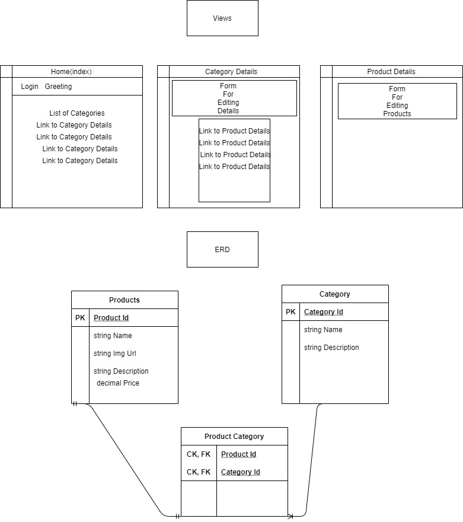

# Serphina's Sundries Dashboard
A Dashboard for the owner of an E-Commerse Application to view, create, edit, and delete categories and products from their store.

## Authors
Kjell Overholt, Ameilia Valdes

## Approach and Planning

This Application has 3 views: 
- The Index view acts as the home page, where you can view all categories. Upon clicking a category, you are redirected to the Category Details View.
- The Category Details view will hold the form needed to create or update a category, as well as a list of all products belonging to that category. Upon clicking a product it will bring you to the Product Details view. Upon submitting the form it will redirect you to a comfirmation page.
- The Product Details view will hold the form needed to create or update a product, as well as the details associated with the selected Product. Submitting the form will redirect you to a confirmation page.

APIKeyName: EcommerceEmail

References:
	Special thanks to freeformatter for the states dropdown at checkout.